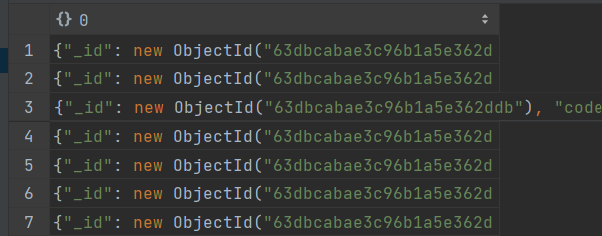
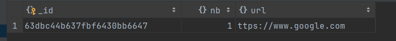
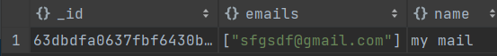
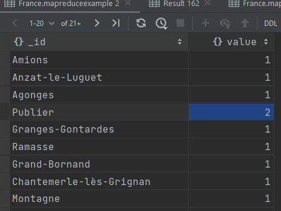
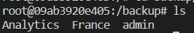

# Rapport de TP 

DASSEUX Damien
MALACARNE Etienne

## Partie 1 à 5 

Dans cette partie, nous avons juste setup l'environnement de travail pour ce tp. Nous utilisons docker, du coup il y avait pas mal de commande à faire, mais ça va.

Voici un screenshot d'une commande pour montrer que tout fonctionne :
mettre image ici db count

## Partie 6 

Dans cette partie , nous devons faire un curseur. 
Il est interessant d'apprendre que *tojson* n'existe pas/plus.

Voici les résultats obtenus ainsi que le code :
```js
use France
var myCursor = db.communes.find( {} ).limit(100);
while (myCursor.hasNext()) {
    print(myCursor.next());
}
```

Voici le résultat : 


## Partie 7 

Dans cette partie, nosu devons calculer le temps que va mettre une requete pour chercher une ville précise. \
Vous trouverez la fonction qui fait cela sous le nom `display_temps_acces`. 

Nous avons calculer le temps moyen pour la ville d'Annecy : 0.025117158889770508 secondes.

Il est interessant de remarquer que plus la ville est loi dans le dataset, plus le temps de récupération est moindre.

Nous avons également calculer le temps moyens de lecture pour les 100 première ville et voici le résultat: 
0.00040010929107666017 secondes.

## Partie 8

Nous avons décidé de faire des index sur les colonnes : 
code_commune_INSEE, code_postal, code_commune, nom_commune, code_departement, nom_departement, code_region, nom_region.

```js
db.communes.createIndexes([{"code_commune_INSEE": 1}, { "code_postal": 1}, { "code_commune": 1}, { "nom_commune": 1}, { "code_departement": 1}, { "nom_departement": 1}, { "code_region": 1}, { "nom_region": 1}])

```

L'unicité pourrait etre possible, mais les données ne sont pas tres propres et empeche cela. Il y a notemment la "ligne_5" qui pose problème, c'est à cause d'elle que les clé primaire ne peuvent pas exister.

Quand on ré-execute le programme de la partie 7,on obtiens ce temps pour la ville d'Annecy : 0.024588823318481445 sc
C'est donc environ 0.006 sc plus rapide.
Mais comme il n'y a pas beaucoup de données , le gain n'est pas vraiement significatif. Au bout de 10 000 requete, il y aurait deja un gain plus intérressant.


## Partie 9

Afin de créer la nouvelle base de données et mettre une données à l'intérieur, on fait : 
```js
use Analytics
createdObject = db.freq.insertOne({url:"ttps://www.google.com", nb:1})

db.freq.find({})
```




Pour la suite, on remarque que le TP n'est pas à jour, du coup le update n'existe plus,il faut utiliser updateOne.

```js
db.freq.updateOne({_id : createdObject["insertedId"]}, {$inc: {nb : 1}})
```

Résultat : 
```js
{"_id": new ObjectId("63dbb2e8637fbf6430bb6637"), "url": "ttps://www.google.com", "nb": new NumberInt("2")}
```

# Partie 10
Dans cette partie, le but est de créer une table avec un champ qui est une array.

En voici le code ainsi que des exemples :
```js
use mailing 

list = {
    name: "my mail",
    emails: ["sfgsdf@gmail.com"]
}

createdObject =  db.lists.insertOne(list)

db.lists.updateOne({_id:createdObject["insertedId"]},{$push:{emails:"xhbshgxvqzx@gmail.xom"}})

db.lists.updateOne({_id:createdObject["insertedId"]},{$pull:{emails:"xhbshgxvqzx@gmail.xom"}})
```

Voila les résultats : 


# Partie 11 : 

Nous avons créé ces 3 utilisateurs : 
```js
db.users.insertMany([
{
    name: "DASSEUX",
    firstname: "Damien",
    email: "dasseuxd@etu.univ-smb.fr"
},
{
    name: "MALACARNE",
    firstname: "Etienne",
    email: "malacarne@etu.univ-smb.fr"
},
{
    name: "BOUGHANMI",
    firstname: "Rami",
    email: "bougrami@etu.univ-smb.fr"
}])
```
Remarque : les retours de la fonction insertMany sont inutiles.

On supprime ensuite la collection : 
```js
db.lists.drop()
```

Par la suite, pour créer un noveau listing : 
```js
db.lists.insertOne({
    name: "Mailing-List 1",
    users: [
        ObjectId("63dbb8f0637fbf6430bb663b"),
        ObjectId("63dbb8f0637fbf6430bb663c")
    ]
})
```

Résultat : 

```js
{"_id": new ObjectId("63dbba37637fbf6430bb6643"), "name": "Mailing-List 1", "users": [new ObjectId("63dbb8f0637fbf6430bb663b"), new ObjectId("63dbb8f0637fbf6430bb663c")]}
```

Pour choper toutes les infos, nous avons remarqué que `populate` n'existe pas en python. C'est la fonction `display_mailing_list` qui va s'occuper de cela \
Voici le résultat de la commande : 

```js
{
    '_id': ObjectId('63dbba37637fbf6430bb6643'), 
    'name': 'Mailing-List 1', 
    'users': [
        {
            '_id': ObjectId('63dbb8f0637fbf6430bb663b'), 
            'name': 'DASSEUX', 
            'firstname': 'Damien', 
            'email': 'dasseuxd@etu.univ-smb.fr'
        }, 
        {
            '_id': ObjectId('63dbb8f0637fbf6430bb663c'), 
            'name': 'MALACARNE', 
            'firstname': 'Etienne', 
            'email': 'malacarne@etu.univ-smb.fr'
        }
    ]
}
```

## Partie 12
Dans cette partie, on s'intéresse au système d'authentification et de gestions des droits des utilisateurs.

Nous avons créée deux users avec des droits différents.

Néanmoins, nous n'avons pas pu réellement tester cela , car quand nous l'avons faits, docker a crashé et nous avons du recommencer.

## Partie 13

Encore une fois, ici nous avons rencontré des problème car des fonctions était déprécier. Avec l'aide de ChatGPT, nous avons réglé le problème. \
il est aussi important de savoir que ces commandes ne fonctionnent que si on les execute depuis le serveur. Le faire depuis un client génère une erreur.

```js
use France

var mapFunction = function() {
    if (this.code_region == 84) emit(this.nom_commune, 1);
}

var reduceFunction = function(nom, index) {
    var total = 0;
    
    index.forEach(function(value) {
        total += value;
    });
    return total;
}

db.communes.mapReduce(mapFunction, reduceFunction, {out : "mapreduceexample"})

db.mapreduceexample.find()

```

Voici les résultats :


## Part 14

Cette partie concernait la sauvegarde et la restauration des données. \
Nous avons fait une sauvegarde dans un dossier backup : 


## Part 15

On a un ensemble de ville avec un nom, un état et une population.
A partir de cela, on veut récupérer le nombre d'habitant par états.  
```js
db.villes.aggregate(
    {$group: {_id:"$state"}, population:{$sum:"$pop"}}
)
```

Maintenant, si on, veut seulement la population pour l'état "RI", on fait : 
```js
db.villes.aggregate(
    {$match: {state: "RI"}},
    {$group: {_id:"$state", population:{$sum:"$pop"}}}
)
```

Maintenant on veut la population moyenne des villes:
```js
db.villes.aggregate(
    {$group: {_id:"$state", population:{$avg:"$pop"}}}
)
```

On veut que les villes soient triées de la plus grande population à la plus petite : 
```js
db.villes.aggregate(
    {$group: {_id:"$state", population:{$sum:"$pop"}}}, 
    {$sort: {population: -1}}
)
```